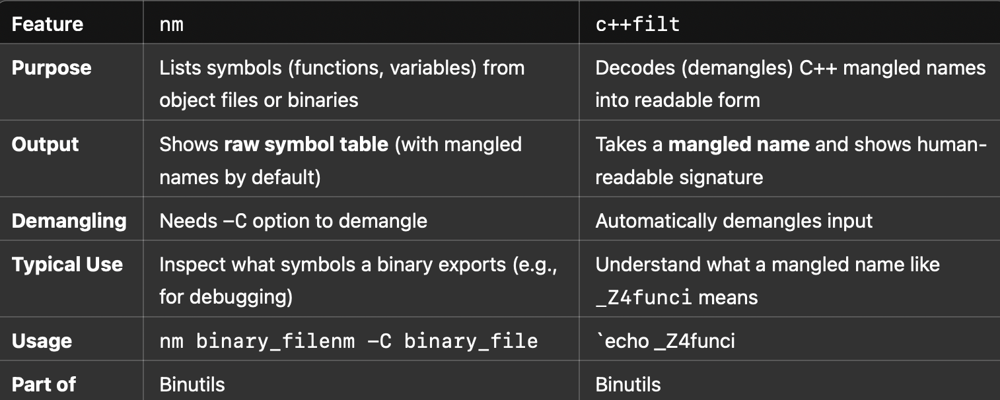
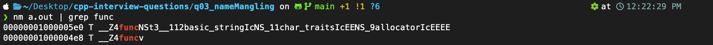

# 🔁 Function Overloading & Name Mangling in C++

This README explains how **function overloading** works in C++ and how **name mangling** enables it under the hood.

---

## 🧾 What is Function Overloading?

Function overloading lets you create multiple functions with the **same name** but **different parameters** in:

* Number of parameters
* Types of parameters
* Order of parameters

### ✅ Valid Overloading:

```cpp
void greet();
void greet(string name);
void greet(string name, int age);
```

### ❌ Invalid Overloading (Only return type differs):

```cpp
int show();
float show();  // ❌ Error: Signature is ambiguous
```

---

## ⚙️ How it Works: Name Mangling

C++ compilers use **name mangling** to distinguish between overloaded functions.

### 🎯 Example

```cpp
void func(int);
void func(double);
```

Internally, the compiler mangles their names to something like:

```
_Z4funci     // for func(int)
_Z4funcd     // for func(double)
```

This way, each function has a unique symbol.

### 📌 Name Mangling Enables:

* **Function overloading**
* **Linker resolution** of symbols

> 🧠 Tip: You can inspect mangled names using `nm` or `c++filt` tools:

```bash
nm a.out | grep func
```

---

## 🧪 Full Code Example

```cpp
#include <iostream>
#include <string>
using namespace std;

// Function with no parameters
void func() {
    cout << "hello" << endl;
}

// Overloaded function with a string parameter
void func(string name) {
    cout << name << endl;
}

int main() {
    func();          // Calls func()
    func("yuvraj");  // Calls func(string)
    return 0;
}

```
___
## See -> (nm and c++filt)






---
## 🤔 Interview Questions

| Question                                             | Quick Answer                                                                   |
| ---------------------------------------------------- | ------------------------------------------------------------------------------ |
| What is function overloading?                        | Defining multiple functions with the same name but different parameters        |
| What is name mangling?                               | Process of encoding function names with type info to create unique identifiers |
| Why is return type alone not enough for overloading? | Because it doesn't change the function's signature                             |
| When is the overloaded function selected?            | At compile time – known as static polymorphism                                 |

---

## 🧠 Summary Cheat Sheet

```
- Function overloading = same name, different params
- Name mangling = unique symbol names for linker
- Resolved at compile time
- Use nm / c++filt to inspect mangled names
```
